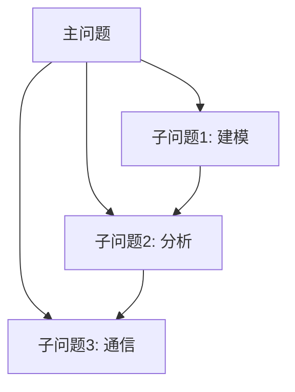

# 问题分解器 (Problem Decomposer)

## 功能概述

将复杂的美赛问题分解为可管理的子问题，建立问题分解树和依赖关系图。

## 分解方法论

基于MM-Agent四阶段框架：

### 1. 开放问题分析 (Open-ended Analysis)
- 识别问题的核心挑战
- 确定问题的边界和范围
- 识别关键利益相关者

### 2. 结构化模型制定 (Structured Formulation)
- 将问题转化为数学语言
- 确定输入-输出关系
- 识别决策变量和参数

### 3. 计算求解策略 (Computational Strategy)
- 选择合适的求解方法
- 评估计算复杂度
- 规划求解顺序

### 4. 报告生成规划 (Report Planning)
- 规划论文结构
- 确定交付物清单
- 安排时间分配

## 输出格式

### 问题分解树
```json
{
  "root": {
    "id": "main",
    "description": "主问题描述",
    "children": [
      {
        "id": "sub1",
        "description": "子问题1",
        "type": "modeling",
        "priority": "high",
        "estimated_hours": 8,
        "dependencies": [],
        "children": [
          {
            "id": "sub1.1",
            "description": "子子问题1.1",
            "type": "data_collection"
          }
        ]
      },
      {
        "id": "sub2",
        "description": "子问题2",
        "type": "analysis",
        "priority": "medium",
        "dependencies": ["sub1"]
      }
    ]
  }
}
```

### 依赖关系图


## 分解策略

### 按功能分解
- 建模子问题
- 分析子问题
- 验证子问题
- 通信子问题

### 按时序分解
- 数据准备阶段
- 模型构建阶段
- 求解验证阶段
- 报告撰写阶段

### 按复杂度分解
- 核心问题 (必须解决)
- 扩展问题 (增强分析)
- 优化问题 (锦上添花)

## 时间分配建议

| 阶段 | 建议时间占比 | 典型任务 |
|------|------------|---------|
| Day 1 (前6小时) | 8% | 选题、理解、分解 |
| Day 2 | 45% | 核心建模、求解 |
| Day 3 | 30% | 论文主体、可视化 |
| Day 4 | 17% | 修改、润色、提交 |

## 相关技能

- `problem-parser` - 问题解析
- `sub-problem-analyzer` - 子问题分析
- `model-selector` - 模型选择
